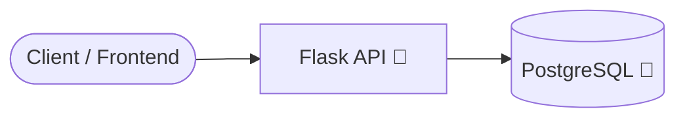

# 🏥 Healthcare API


## 📖 Table des matières
- [Aperçu](#-aperçu)
- [Architecture](#-architecture)
- [Installation](#-installation)
- [Utilisation](#-utilisation)
- [Endpoints](#-endpoints)
- [Technologies](#-technologies)
- [License](#-license)

---

## 🔎 Aperçu
Cette API RESTful gère les **patients d’un système de santé**.  
Elle inclut :
- ✅ Authentification JWT (login/register)
- ✅ CRUD complet pour les patients
- ✅ Base de données PostgreSQL
- ✅ Déploiement via Docker & docker-compose

---

## 🏗 Architecture



---

## ⚙️ Installation

1. **Cloner le repo**
   ```bash
   git clone https://github.com/ton-profil/Healthcare-app.git
   cd Healthcare-app
   ```

2. **Configurer l’environnement**  
   Crée un fichier `.env` :
   ```env
   POSTGRES_USER=admin
   POSTGRES_PASSWORD=adminpassword
   POSTGRES_DB=healthcare
   DATABASE_URL=postgresql://admin:adminpassword@db:5432/healthcare
   JWT_SECRET_KEY=supersecretkey
   FLASK_ENV=development
   ```

3. **Lancer avec Docker**
   ```bash
   docker-compose up --build
   ```

Ton API sera dispo sur 👉 [http://127.0.0.1:5000](http://127.0.0.1:5000)

---

## 🚀 Utilisation

### 🔑 Authentification
- **Register**  
  `POST /auth/register`  
  ```json
  {
    "username": "slim",
    "password": "mypassword"
  }
  ```

- **Login**  
  `POST /auth/login`  
  ```json
  {
    "username": "slim",
    "password": "mypassword"
  }
  ```

  ➡️ Retourne un `access_token` JWT

---

## 🧑‍⚕️ Endpoints

- `POST /auth/register` → Inscription utilisateur  
- `POST /auth/login` → Connexion utilisateur  
- `GET /patients/` → Liste des patients  
- `POST /patients/` → Ajouter un patient  
- `GET /patients/{id}` → Détails d’un patient  
- `PUT /patients/{id}` → Modifier un patient  
- `DELETE /patients/{id}` → Supprimer un patient  

---

## 🛠 Technologies

- [Flask](https://flask.palletsprojects.com/) – API REST  
- [Flask-JWT-Extended](https://flask-jwt-extended.readthedocs.io/) – Authentification JWT  
- [PostgreSQL](https://www.postgresql.org/) – Base de données  
- [Docker](https://www.docker.com/) – Conteneurisation  

---

## 📜 License

Distribué sous licence **MIT**.  
Tu peux utiliser, modifier et partager librement 🚀.
